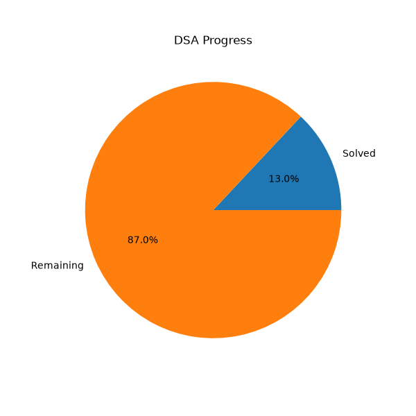

# 🚀 DSA Interview Preparation Tracker

## Progress

* Total Questions: **128**
* Solved: **7**
* Remaining: **121**

---

## Progress Chart

# Arrays & Strings (20)

* [X] Two Sum
* [X] Best Time to Buy and Sell Stock
* [X] Contains Duplicate
* [X] Product of Array Except Self
* [ ] Maximum Subarray
* [ ] Merge Sorted Array
* [ ] Move Zeroes
* [ ] Rotate Array
* [ ] Majority Element
* [X] Valid Anagram
* [ ] Group Anagrams
* [ ] Longest Common Prefix
* [ ] Valid Palindrome
* [X] Reverse String
* [ ] Reverse Words in String
* [ ] Longest Substring Without Repeating Characters
* [ ] Longest Palindromic Substring
* [ ] 3Sum
* [ ] Container With Most Water
* [ ] Trapping Rain Water

# Binary Search (10)

* [X] Binary Search
* [ ] Search Insert Position
* [ ] First Bad Version
* [ ] Search in Rotated Sorted Array
* [ ] Find Minimum in Rotated Sorted Array
* [ ] Search 2D Matrix
* [ ] Find First and Last Position
* [ ] Peak Element
* [ ] Koko Eating Bananas
* [ ] Capacity To Ship Packages

# HashMap / HashSet (10)

* [ ] Two Sum
* [ ] Contains Duplicate
* [ ] Valid Anagram
* [ ] Longest Consecutive Sequence
* [ ] Top K Frequent Elements
* [ ] Subarray Sum Equals K
* [ ] Isomorphic Strings
* [ ] Word Pattern
* [ ] Happy Number
* [ ] Find Duplicate Number

# Two Pointers (8)

* [ ] Valid Palindrome
* [ ] Two Sum II
* [ ] Move Zeroes
* [ ] Remove Duplicates
* [ ] Container With Most Water
* [ ] 3Sum
* [ ] Sort Colors
* [ ] Squares of Sorted Array

# Sliding Window (10)

* [ ] Longest Substring Without Repeating Characters
* [ ] Find All Anagrams in a String
* [ ] Minimum Window Substring
* [ ] Permutation In String
* [ ] Sliding Window Maximum
* [ ] Maximum Average Subarray
* [ ] Fruit Into Baskets
* [ ] Character Replacement
* [ ] Max Consecutive Ones III
* [ ] Minimum Size Subarray Sum

# Linked List (10)

* [ ] Reverse Linked List
* [ ] Middle Of Linked List
* [ ] Linked List Cycle
* [ ] Palindrome Linked List
* [ ] Merge Two Sorted Lists
* [ ] Remove Nth Node From End
* [ ] Reorder List
* [ ] Add Two Numbers
* [ ] Copy Random Pointer
* [ ] Intersection Of Linked Lists

# Stack & Queue (8)

* [ ] Valid Parentheses
* [ ] Min Stack
* [ ] Daily Temperatures
* [ ] Next Greater Element
* [ ] Decode String
* [ ] Evaluate Reverse Polish Notation
* [ ] Largest Rectangle Histogram
* [ ] Generate Parentheses

# Trees & BST (18)

* [ ] Maximum Depth
* [ ] Same Tree
* [ ] Invert Binary Tree
* [ ] Balanced Binary Tree
* [ ] Diameter Of Binary Tree
* [ ] Binary Tree Level Order Traversal
* [ ] Right Side View
* [ ] Validate BST
* [ ] Lowest Common Ancestor
* [ ] Kth Smallest In BST
* [ ] Path Sum
* [ ] Symmetric Tree
* [ ] Construct Tree From Traversals
* [ ] Serialize Deserialize Tree
* [ ] Subtree Of Another Tree
* [ ] Maximum Path Sum
* [ ] Count Good Nodes
* [ ] BST Iterator

# Heap / Priority Queue (8)

* [ ] Kth Largest Element
* [ ] Top K Frequent Elements
* [ ] Merge K Sorted Lists
* [ ] Median From Data Stream
* [ ] K Closest Points
* [ ] Meeting Rooms II
* [ ] Task Scheduler
* [ ] Reorganize String

# Graphs (8)

* [ ] Number Of Islands
* [ ] Clone Graph
* [ ] Flood Fill
* [ ] Course Schedule
* [ ] Course Schedule II
* [ ] Rotting Oranges
* [ ] BFS Traversal
* [ ] DFS Traversal

# Dynamic Programming (8)

* [ ] Climbing Stairs
* [ ] House Robber
* [ ] House Robber II
* [ ] Coin Change
* [ ] Longest Increasing Subsequence
* [ ] Longest Common Subsequence
* [ ] Unique Paths
* [ ] Word Break

# Recursion & Backtracking (10)

* [ ] Subsets
* [ ] Permutations
* [ ] Combination Sum
* [ ] Letter Combinations of a Phone Number
* [ ] Palindrome Partitioning
* [ ] N Queens
* [ ] Word Search
* [ ] Generate Parentheses
* [ ] Combination Sum III
* [ ] Subsets II

---

## Revision Tracker

### Revision 1

* [ ] Completed

### Revision 2

* [ ] Completed

### Revision 3

* [ ] Completed

---

## Notes

### Common Patterns

* [ ] HashMap
* [ ] Two Pointers
* [ ] Sliding Window
* [ ] Binary Search
* [ ] Fast & Slow Pointer
* [ ] BFS
* [ ] DFS
* [ ] Backtracking
* [ ] Heap
* [ ] Dynamic Programming

### Interview Ready Checklist

* [ ] Can solve Easy in 15 minutes
* [ ] Can solve Medium in 30 minutes
* [ ] Can explain Time Complexity
* [ ] Can explain Space Complexity
* [ ] Can write bug-free Java code
