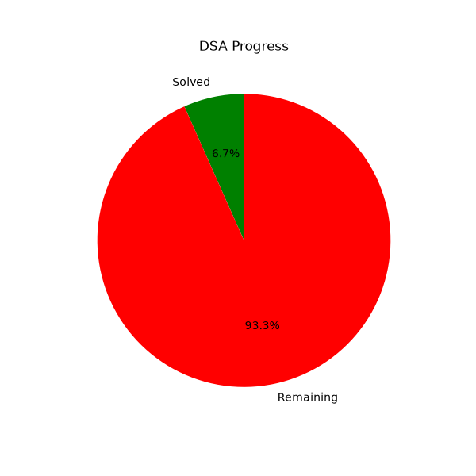

# 🕉️ Sri Yoganarasimha Swamy Prasanna 🦁

# 🚀 DSA Interview Preparation Tracker

## Progress

* Total Questions: **162**
* Solved: **09**
* Remaining: **153**

---

## Progress Chart

# Arrays (15)

* [X] Two Sum
* [X] Contains Duplicate
* [X] Best Time to Buy and Sell Stock
* [X] Maximum Subarray
* [X] Product of Array Except Self
* [X] Maximum Product Subarray
* [X] Move Zeroes
* [ ] Merge Sorted Array
* [ ] Majority Element
* [X] Rotate Array
* [ ] Find the Duplicate Number
* [ ] Missing Number
* [ ] Subarray Sum Equals K
* [ ] Longest Consecutive Sequence
* [ ] Maximum Subarray Sum with One Deletion

# Strings + Hashing (15)

* [X] Valid Anagram
* [ ] Valid Palindrome
* [ ] First Unique Character in a String
* [ ] Ransom Note
* [ ] Group Anagrams
* [ ] Longest Substring Without Repeating Characters
* [ ] Longest Palindromic Substring
* [ ] Palindromic Substrings
* [ ] Isomorphic Strings
* [ ] Word Pattern
* [ ] Longest Common Prefix
* [ ] String Compression
* [ ] Encode and Decode Strings
* [ ] Minimum Window Substring
* [ ] Find All Anagrams in a String

# Two Pointers (8)

* [ ] Two Sum II
* [ ] 3Sum
* [ ] 3Sum Closest
* [ ] Container With Most Water
* [ ] Valid Palindrome
* [ ] Remove Duplicates from Sorted Array
* [ ] Squares of a Sorted Array
* [ ] Trapping Rain Water

# Sliding Window (10)

* [ ] Maximum Average Subarray I
* [ ] Maximum Number of Vowels in a Substring
* [ ] Longest Substring Without Repeating Characters
* [ ] Longest Repeating Character Replacement
* [ ] Permutation in String
* [ ] Find All Anagrams in a String
* [ ] Minimum Window Substring
* [ ] Longest Subarray of 1's After Deleting One Element
* [ ] Fruit Into Baskets
* [ ] Minimum Size Subarray Sum

# Binary Search (10)

* [ ] Binary Search
* [ ] Search Insert Position
* [ ] First Bad Version
* [ ] Find First and Last Position
* [ ] Search in Rotated Sorted Array
* [ ] Find Minimum in Rotated Sorted Array
* [ ] Search a 2D Matrix
* [ ] Koko Eating Bananas
* [ ] Capacity To Ship Packages Within D Days
* [ ] Median of Two Sorted Arrays

# Linked List (10)

* [ ] Reverse Linked List
* [ ] Merge Two Sorted Lists
* [ ] Linked List Cycle
* [ ] Linked List Cycle II
* [ ] Remove Nth Node From End
* [ ] Middle of Linked List
* [ ] Reorder List
* [ ] Add Two Numbers
* [ ] Copy List with Random Pointer
* [ ] Merge k Sorted Lists

# Stack / Monotonic Stack (10)

* [ ] Valid Parentheses
* [ ] Min Stack
* [ ] Evaluate Reverse Polish Notation
* [ ] Daily Temperatures
* [ ] Next Greater Element I
* [ ] Next Greater Element II
* [ ] Largest Rectangle in Histogram
* [ ] Car Fleet
* [ ] Simplify Path
* [ ] Asteroid Collision

# Queue / Deque (5)

* [ ] Implement Queue using Stacks
* [ ] Implement Stack using Queues
* [ ] Number of Recent Calls
* [ ] Design Circular Queue
* [ ] Sliding Window Maximum

# Intervals (8)

* [ ] Merge Intervals
* [ ] Insert Interval
* [ ] Non-overlapping Intervals
* [ ] Meeting Rooms
* [ ] Meeting Rooms II
* [ ] Minimum Number of Arrows
* [ ] Interval List Intersections
* [ ] Employee Free Time

# Trees / BST (15)

* [ ] Maximum Depth of Binary Tree
* [ ] Same Tree
* [ ] Invert Binary Tree
* [ ] Binary Tree Inorder Traversal
* [ ] Binary Tree Preorder Traversal
* [ ] Binary Tree Level Order Traversal
* [ ] Diameter of Binary Tree
* [ ] Balanced Binary Tree
* [ ] Path Sum
* [ ] Lowest Common Ancestor
* [ ] Validate BST
* [ ] Kth Smallest Element in BST
* [ ] Binary Tree Right Side View
* [ ] Construct Binary Tree
* [ ] Binary Tree Maximum Path Sum

# Heap / Priority Queue (8)

* [ ] Kth Largest Element
* [ ] Last Stone Weight
* [ ] K Closest Points to Origin
* [ ] Top K Frequent Elements
* [ ] Find Median from Data Stream
* [ ] Kth Largest Element in a Stream
* [ ] Task Scheduler
* [ ] Reorganize String

# Graphs (15)

* [ ] Number of Islands
* [ ] Flood Fill
* [ ] Clone Graph
* [ ] Max Area of Island
* [ ] Pacific Atlantic Water Flow
* [ ] Rotting Oranges
* [ ] Course Schedule
* [ ] Course Schedule II
* [ ] Connected Components
* [ ] Graph Valid Tree
* [ ] Word Ladder
* [ ] Network Delay Time
* [ ] Cheapest Flights Within K Stops
* [ ] Accounts Merge
* [ ] Redundant Connection

# Backtracking (7)

* [ ] Subsets
* [ ] Subsets II
* [ ] Permutations
* [ ] Combination Sum
* [ ] Combination Sum II
* [ ] Letter Combinations of Phone Number
* [ ] Word Search

# Greedy (7)

* [ ] Best Time to Buy and Sell Stock II
* [ ] Jump Game
* [ ] Jump Game II
* [ ] Gas Station
* [ ] Partition Labels
* [ ] Assign Cookies
* [ ] Non-overlapping Intervals

# Dynamic Programming (14)

* [ ] Climbing Stairs
* [ ] House Robber
* [ ] House Robber II
* [ ] Coin Change
* [ ] Maximum Product Subarray
* [ ] Longest Increasing Subsequence
* [ ] Longest Common Subsequence
* [ ] Word Break
* [ ] Partition Equal Subset Sum
* [ ] Decode Ways
* [ ] Unique Paths
* [ ] Combination Sum IV
* [ ] Edit Distance
* [ ] Longest Palindromic Subsequence

# Bit Manipulation (5)

* [ ] Single Number
* [ ] Number of 1 Bits
* [ ] Counting Bits
* [ ] Reverse Bits
* [ ] Missing Number

---

## Revision Tracker

### Revision 1

* [ ] Completed

### Revision 2

* [ ] Completed

### Revision 3

* [ ] Completed

---

## Notes

### Common Patterns

* [ ] HashMap
* [ ] Two Pointers
* [ ] Sliding Window
* [ ] Binary Search
* [ ] Fast & Slow Pointer
* [ ] BFS
* [ ] DFS
* [ ] Backtracking
* [ ] Heap
* [ ] Dynamic Programming

### Interview Ready Checklist

* [ ] Can solve Easy in 15 minutes
* [ ] Can solve Medium in 30 minutes
* [ ] Can explain Time Complexity
* [ ] Can explain Space Complexity
* [ ] Can write bug-free Java code

---

## Study Plan & Time Estimates

**Total Time Required: ~190 hrs**

| Activity | Approx. Time |
| :--- | :--- |
| First attempt | ~105 hrs |
| Understanding solutions/hints | ~25 hrs |
| Re-solving difficult problems | ~25 hrs |
| Revision | ~20 hrs |
| Timed interview practice | ~15 hrs |

### Daily Commitments

*   **2 hours/day:** ~3–3.5 months
*   **3 hours/day:** ~2–2.5 months
*   **4 hours/day:** ~7–8 weeks